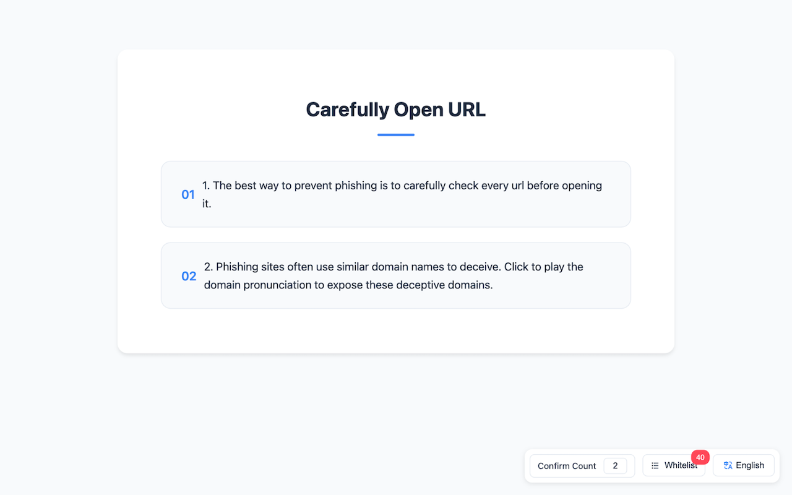
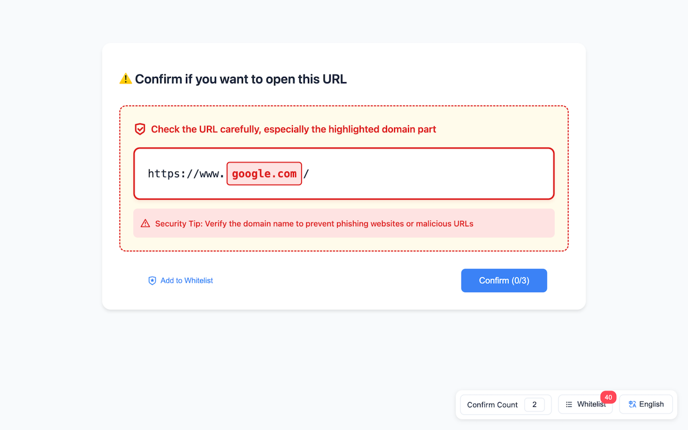

# CarefullyOpenURL

<div align="center">


A Chrome extension that helps users browse the web more safely by adding confirmation steps before open any URLs.

[](LICENSE)
[](https://chromewebstore.google.com/detail/fehlepigmdlihclchflgabggapbdcapa?authuser=2&hl=en)
[](https://github.com/ezshine/CarefullyOpenURL/releases)

[Features](#features) • [Installation](#installation) • [Usage](#usage) • [Contributing](#contributing) • [License](#license)

</div>

## 🌟 Features

- 🛡️ Intercepts all webpage requests for enhanced security
- ⚡ Lightweight and fast performance
- 🔒 Triple confirmation system to prevent accidental clicks
- 👀 Clear visual feedback for each confirmation step
- 🌐 Works on all websites
- 🎨 Clean and intuitive user interface

## 💻 Screenshots




## 📦 Installation

### From Chrome Web Store (Recommended)
1. Visit the [Chrome Web Store](https://chromewebstore.google.com/detail/fehlepigmdlihclchflgabggapbdcapa?authuser=2&hl=en)
2. Click "Add to Chrome"
3. Follow the prompts to complete installation

### Manual Installation (Developer Mode)
1. Download or clone this repository
2. Open Chrome and navigate to `chrome://extensions/`
3. Enable "Developer mode" in the top-right corner
4. Click "Load unpacked"
5. Select the extension directory

## 🚀 Usage

1. Click any link on any webpage
2. A confirmation dialog will appear
3. Click the confirmation button three times
4. Click the "Visit Website" button to proceed to your destination

## 🔧 Development

### Prerequisites
- Google Chrome Browser
- Basic knowledge of HTML, CSS, and JavaScript
- Git (optional, for version control)

### Setup Development Environment
```bash
# Clone the repository
git clone https://github.com/ezshine/CarefullyOpenURL.git

# Navigate to the project directory
cd CarefullyOpenURL

# Start developing!
```

## 🤝 Contributing

We welcome contributions! Here's how you can help:

1. Fork the repository
2. Create your feature branch (`git checkout -b feature/AmazingFeature`)
3. Commit your changes (`git commit -m 'Add some AmazingFeature'`)
4. Push to the branch (`git push origin feature/AmazingFeature`)
5. Open a Pull Request

## 📝 License

This project is licensed under the MIT License - see the [LICENSE](LICENSE) file for details.

## 🙏 Acknowledgments

- Thanks to all contributors who have helped this project grow
- Special thanks to the Chrome Extensions development community

## 📞 Contact

- Social: [@ezshine](https://x.com/intent/follow?screen_name=ezshine)

## ⭐ Support

If you find this project helpful, please consider giving it a star on GitHub!

---

<div align="center">
Made with ❤️ by <a href='https://x.com/intent/follow?screen_name=ezshine'>@ezshine</a>
</div>